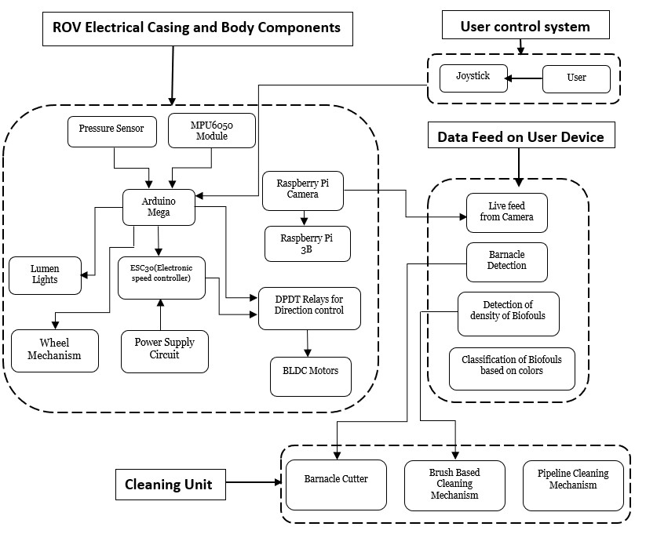
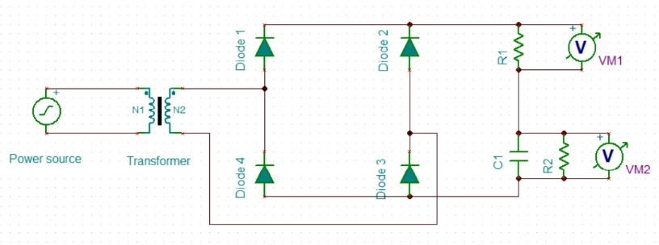
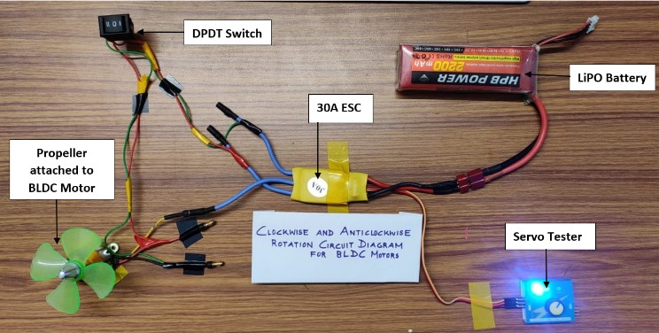
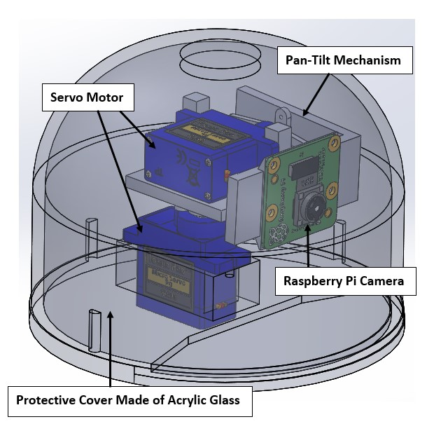
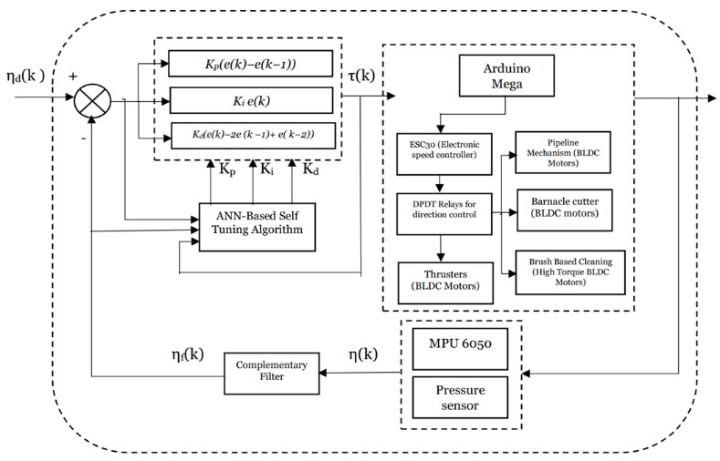
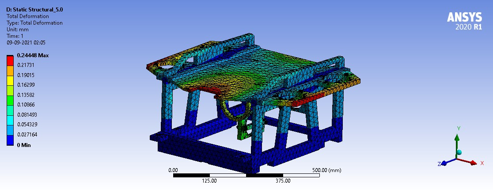
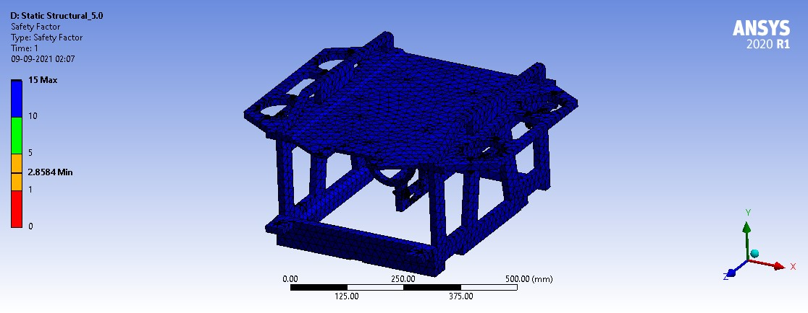

# Design of a Remotely Operated Vehicle (ROV) for Biofoul Cleaning and Inspection of Variety of Underwater Structures

This repository contains the details and source code related to our research on the design of a Remotely Operated Vehicle (ROV) aimed at cleaning biofoul and inspecting various underwater structures. This project was presented at the 9th RSI International Conference on Robotics and Mechatronics (ICRoM 2021).

## Abstract

Biofouling, the accumulation of microorganisms on submerged surfaces, poses significant risks to underwater structures, including dams, ship hulls, and pipelines. Our ROV aims to effectively remove biofouling from these surfaces, reducing human intervention in hazardous aquatic environments and enhancing cleaning efficiency and safety. The ROV is equipped with multiple cleaning mechanisms and advanced imaging technologies to perform thorough inspections and cleaning tasks.

## Authors

- **Arun Srinivasan** [arunsrinivasan1210@gmail.com](mailto:arunsrinivasan1210@gmail.com)
- **Nandha Kizor V** [nandhakizorv@gmail.com](mailto:nandhakizorv@gmail.com)
- **Burhanuddin Shirose** [burhanuddinshirose@gmail.com](mailto:burhanuddinshirose@gmail.com)
- **Mainak Adak** [mainakadak.nitt@gmail.com](mailto:mainakadak.nitt@gmail.com)
- **Mitesh Kumar** [meet1655@gmail.com](mailto:meet1655@gmail.com)
- **Sudarsana Jayandan J** [sudarsan.nitt@gmail.com](mailto:sudarsan.nitt@gmail.com)
- **Raashid Sheikh Muhammad** [raashid.sm@gmail.com](mailto:raashid.sm@gmail.com)

## Introduction

Biofouling significantly impacts various underwater structures and industries by increasing drag, fuel consumption, and causing physical damage. Traditional methods of removing biofouling are labor-intensive and hazardous. Our ROV design addresses these challenges with innovative cleaning mechanisms and inspection capabilities.

## Features

- **Multiple Cleaning Mechanisms**: Includes brush-based cleaning, barnacle cutting, and pipeline cleaning mechanisms to tackle different types of biofouling.
- **Advanced Imaging and Inspection**: Equipped with a wide-angle camera and Machine Learning algorithms for biofoul classification and Non-Destructive Testing (NDT).
- **Efficient Propulsion System**: Utilizes a combination of horizontal and vertical thrusters for precise maneuvering and adherence to surfaces.
- **Robust Material Selection**: Constructed using corrosion-resistant and durable materials suitable for underwater environments.
- **Electronic and Sensor Integration**: Features advanced electronic circuits and sensors for control, orientation detection, and environmental monitoring.

## Design and Working

### Workflow

1. **Entry and Navigation**: The ROV enters the water body, and its orientation is detected using the MPU6050 module. Thrusters are activated to navigate the ROV.
2. **Image Capture and Processing**: Upon reaching the target surface, the camera mechanism captures images for processing and inspection.
3. **Cleaning Operations**: The appropriate cleaning mechanism is activated based on the surface and type of biofoul detected.



<p align="center"><em> Fig 1. Flowchart of ROV Subsystems. </em></p>

### Cleaning Mechanisms

- **Brush-Based Cleaning**: Uses brushes or abrasive pads for scrubbing surfaces.
- **Barnacle Cutter**: Equipped with steel blades with tungsten-carbide edges for removing firmly attached biofouls like barnacles.
- **Pipeline Cleaning**: Utilizes a cylindrical assembly with bristles for cleaning circular structures.

### Propulsion System

The ROV's propulsion system includes seven thrusters (three horizontal and four vertical) to ensure precise control and stability during cleaning operations.

### Materials

Key materials used include HDPE for the body frame, Aluminium-5083, and Stainless Steel-316 for metallic parts, and various polymers for brushes.

### Electronics and Sensors

The ROV integrates an Arduino Mega and a Raspberry Pi, along with various sensors and actuators, to control its operations and ensure effective performance.



<p align="center"><em> Fig 2. Circuit to power a motor’s ESC with 30A. </em></p>



<p align="center"><em> Fig 3. BLDC Motor Speed and Rotation Direction Control Circuit using DPDT Relay. </em></p>



<p align="center"><em> Fig 4. Pan-Tilt Camera Mechanism. </em></p>



<p align="center"><em> Fig 5. Control System of ROV. </em></p>


## Conclusion

Our ROV design offers a comprehensive solution for biofoul cleaning and inspection of underwater structures, enhancing safety, efficiency, and reducing operational costs. 
The innovative features and robust design make it a versatile tool for various underwater applications.



<p align="center"><em> Fig 6. Total Deformation Contour in ANSYS. </em></p>



<p align="center"><em> Fig 7. Safety Factor Analysis in ANSYS. </em></p>


## References

[Proceedings of the 9th RSI International Conference on Robotics and Mechatronics (ICRoM 2021)](https://ieeexplore.ieee.org/document/9663518)

```bibtex
@INPROCEEDINGS{9663518,
  author={V, Nandha Kizor and Shirose, Burhanuddin and Adak, Mainak and Kumar, Mitesh and J, Sudarsana Jayandan and Srinivasan, Arun and Muhammad, Raashid Sheikh},
  booktitle={2021 9th RSI International Conference on Robotics and Mechatronics (ICRoM)}, 
  title={Design of a Remotely Operated Vehicle (ROV) for Biofoul Cleaning and Inspection of Variety of Underwater Structures}, 
  year={2021},
  volume={},
  number={},
  pages={451-457},
  keywords={Surface cleaning;Underwater structures;Remotely guided vehicles;Dams;Inspection;Robot sensing systems;Reservoirs;Biofouling;Barnacles;ROV;Underwater Robot;Underwater Surface Cleaning;Control System;NDT;Image Processing;Cleaning Mechanism},
  doi={10.1109/ICRoM54204.2021.9663518}}
